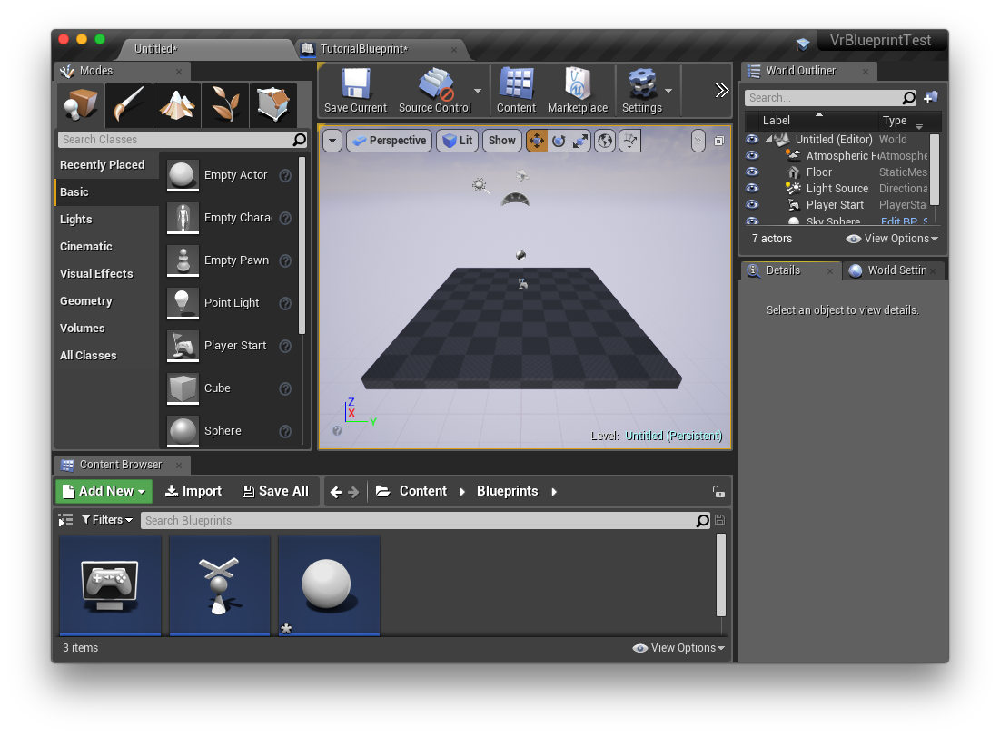
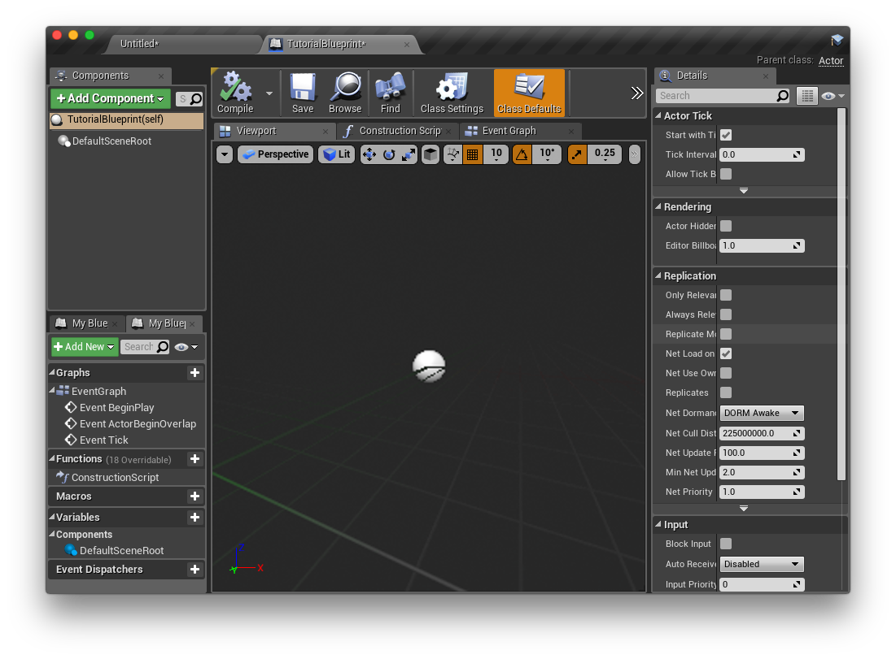
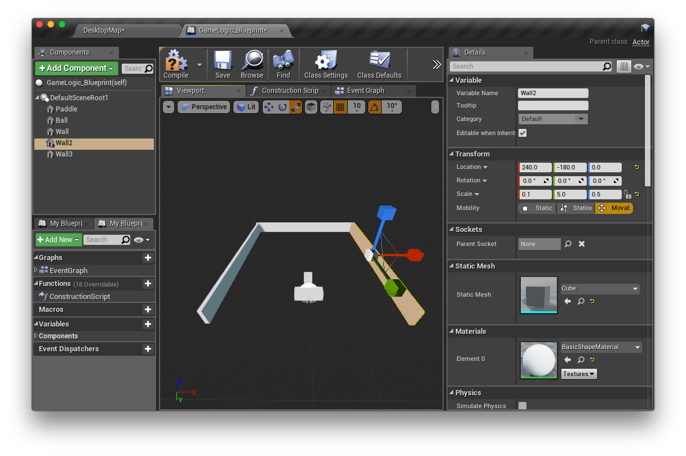
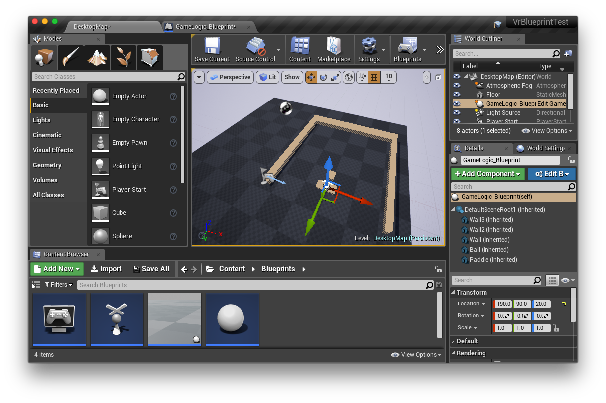

## An unfinished Unreal tutorial

Unreal is a full-service game engine and one of the “big two” engines for small developers right now, along with Unity. Among people I know who’ve used it, Unreal has a reputation for being powerful but not very good for prototyping or quick small projects; a common take is that Unreal starts with a lot of assumptions about your game, expects you to design your game in a particular way or requires a lot of work to make a *kind* of game Unreal didn’t anticipate (IE: Not a first-person or third person shooter). It’s definitely true Epic are *expecting* you to use Unreal in a way that this is true; if you follow the tutorials and most prominent documentation, Epic pushes you to treat Unreal as a large bag of precooked game components, connect those together in a drag-and-drop way and customize around the edges. I’ve been using Unreal for a few weeks now though and I’ve concluded Unreal is actually a *much* more expressive, flexible engine than Epic gives itself credit for. You just need to approach it in a particular way. Here’s how I approach it.

I’m going to start by walking you through setting up a project. If you’re not working along and just want to understand how Unreal works, skip forward to “ACTUALLY MAKING THINGS IN UNREAL” or “MAKING A BLUEPRINT CLASS”.

# BEFORE WE START

**CREATING A PROJECT:** The most complicated/frustrating part of making an off-model Unreal project is starting and setting up the project itself. Our goal for this bit will be to get to the point of having an empty project with no logic, a source control repository (git, svn or plastic), and a “blueprint class” we’ll actually design our project inside. The good news is you only have to do this once: once you reach that point, you’ll have it saved in git and can clone it to create more new projects in the future.

Let’s start by creating the project directory. When you make a project, Unreal asks you to pick a template; I recommend picking either the blank blueprint project, or the VR blueprint project, depending on whether you’re doing VR. It also asks two strange questions. It asks if you want “Scalable 2D or 3D” or do you want “Maximum Quality”. It also asks if you want “standard assets”. I recommend going with No Standard Assets and Maximum Quality. Standard Assets or not determines whether Unreal is going to copy a bunch of textures and things into your project. The “quality” question determines what values it initially sets a bunch of values in Config/DefaultEngine.ini; if you pick “Scalable”, it sets a bunch of additional keys to reduce quality. 

Even if those things sound good to you, I recommend not choosing them for your basic project and going with Maximum Quality / No Standard Assets. Instead, what you can do is create a separate “standard assets” project just to keep around on your computer; and create a throwaway “scalable” project, copy out DefaultEngine.ini, and delete the throwaway. If you have the standard assets project, you can export individual assets and their dependencies out of the standard assets project and into your real project as you need them; the same is true of the (useful!) stuff in the template projects for Third Person or First Person Shooter or whatever. As for DefaultEngine.ini, if you have a copy of that, you can diff it with the one in your real project and copy keys over if you decide you want to check out scalable mode. In both of these cases, it’s easy to have your base project minimal and copy over the things you realize you need later than to initially import things you don’t need and try to untangle them afterward.

**VERSION CONTROL:** When your project is created, Unreal will start you off in a basic map. (Unless you used the VR project; in this case, start by saying “New Level” in the file menu. We’ll come back to VR later.) Initially this map is actually not saved to disk, which I think is sort of nice, but we need to get this into version control. Pick Save All [[or maybe you also need to Save Current? Or is the toolbar button sufficient? I should check this]] and save your map as whatever. We’re now ready to create a version control repository. git init the directory for your project and add *exactly* these directories: Config, Content, and the uproject file. You’ll also need to create a .gitignore and add that. Here’s the one I’m using right now:

/Binaries
/DerivedDataCache
/Intermediate
/Saved
/Content/Collections
/Content/Developers
/Content/Scripts/node_modules
/Content/Scripts/*.js
/Content/Scripts/typings/*.d.ts
/.vscode
*.xcworkspace
# VCXProj here? need to double check the extensions

This is a good time to commit.

**SEMI-OPTIONAL: ADD C++:** The project you’ve created so far is a “blueprint” project. You very likely will want to add C++ later. You don’t *have* to use C++— pure blueprints *is* an option— but *if* you’re going to follow my directions about adding Unreal.JS or SpaceMouse support below, you’ll still need C++, because it’s required for in-project plugins. This part is simple enough: Just click “Add New->C++ Class” on the button in the Unreal editor, and make a class named “EmptyClass”. The act of adding one class will cause Unreal to transform your project into one with an automatic building and reloading system for C++ code. There’s one more step: You need to git add the “Source” folder and all its contents, and then commit again. Unreal will also create a vcxproj or xcode workspace— *don’t* add this to git. Unreal will automatically create this for you whenever it needs one (the controls for this are in the File menu).

**ONE FINAL, WEIRD STEP:** There’s one last thing. Your project is currently empty. But it isn’t *empty*. Even an empty project in Unreal has quite a lot of default code that you have to opt out of. I’ll explain this more exactly in a minute, and if you want you can wait to do this until I’ve explained *why* you’re doing it. But if you really want to start from a clean slate, you need to disable the “GameMode”. Here’s what you do: Go to World Settings in the Window menu. Under here, there is a setting that says “GameMode Override: None”. This does NOT mean your GameMode is “None”. it means your GameMode is the default GameMode. We’re going to create an actual “No GameMode” GameMode.

Next to GameMode Override, click + to create a new GameMode. It will ask what you want to name it. Say “EmptyGameMode”. You now need to actually empty this GameMode: Set the Default Pawn Class as “None”, the HUD class as “None”. Next to PlayerController click “+” and create an EmptyPlayerController. SAVE IT, then close the window. Leave Game State as GameStateBase. Click “+” next to Player State Class, create an “EmptyPlayerState”, SAVE THAT, and close the window. Now Save All [Or whatever??], go back to git, and commit.

Okay, that took a while! But we’re now ready to actually make something. If you decide we want back all that stuff Unreal provides by default? You can just turn it back on— or create a new map, where the defaults will be restored for you.

## RESOURCES

Before we start making anything, it’s really important to be aware of what resources Unreal gives. There’s rather a lot of those. As noted above I don’t think the documentation is good at pointing you in the right direction, but if you already know what direction you’re going the documentation is exhuaustive (with a few frustrating gaps).

The single most important thing to know about is https://docs.unrealengine.com and its big search box. This is a gateway to both the guides Unreal has written, and individual classes within Unreal. Type either a concept, or the name of a class (we’ll get to class names in a moment) into this box, and *after* hitting return click either “Documentation” or “Video Tutorials” (probably both) if you’re looking for a guide, “C++ API” if you’re looking for a C++ class or method (I’ll get to this in a minute), or “Blueprint API” if you’re looking for a Blueprint name or method.

Unreal Answers is a separate wealth of information as well as a place you can post requests for help. You can search that from the docs.unrealengine.com search or by going to it directly: https://answers.unrealengine.com . Unreal Answers is also important because if you find an actual bug, the way you report that is to start an Unreal Answer post and then where it says Category: select “bug reports”. There’s also an official forum (which I have found less useful) and an unofficial discord (which I have found useful) called Unreal Slackers.

If you have experience with Unity, I also *highly* recommend this guide: https://docs.unrealengine.com/latest/INT/GettingStarted/FromUnity

# ACTUALLY MAKING THINGS IN UNREAL. 

So. You’re now inside Unreal with an empty project and an empty map. You can see a World Outliner in the upper right, and a view of your map in the center. In the World Outliner, you’ll see it’s created some default Actors for you; leave them for now, they’re all harmless.

Unreal is all about the interactions between objects. The code for the objects lives in classes. You can define these classes as C++, or as “blueprints”. The blueprints system is really important to understand. The Unreal code typically presents things as if you have a choice between developing as C++ or as Blueprints, but it’s better to think of Blueprints as complementing C++ or even thinking of Blueprints as the primary important thing and C++ as something you only resort to when you need it. There are things that you can do in a blueprint that would be really inconvenient in C++— in fact, in a moment, I’m going to argue that often when you create a C++ class you’ll want to create a blueprint to go with it, to handle the bits that are more convenient there.

**ABOUT TREES:** There are a few different hierarchies that are important when understanding how Unreal objects relate to each other. This can get confusing, so I’m going to be really careful not to use the words “parent” and “child” without qualification. There’s three specific hierarchies that matter.

One is the class hierarchy— in the sense of conventional object oriented programming. This matters both for C++ and blueprint objects, because every blueprint is silently, behind the scenes, compiled into a C++ file (the Unreal documentation often uses the term “blueprint class” interchangeably with “blueprint” for this reason). I’m going to use “inheritance-parent” and “inheritance-child” to describe this relationship.

The second hierarchy is the actor-component “attachment” hierarchy. I’ll explain this more in a moment, but all you need to know is that this is the list of objects in the “World Outliner”. The World Outliner is a tree of Actors which are “attached” to each other, and if you click on an actor you’ll see a tree of components which are either “attached” to the actor or “attached” to one of the actor’s components. Again, more on this in a moment, but I’m going to use “attachment-parent” and “attachment-child” to describe this relationship.

The third hierarchy is the memory hierarchy. I don’t understand this very well yet, but Unreal has something called “ownership”; if one object “owns” another, then the “owned” object gets automatically deleted when the “owner” is deleted. I’m going to call this “ownership-parent” and “ownership-child”. The only important thing to know here is that attachment and ownership are *different*. Usually when you set something up as an attachment-parent you *also* set it up as an ownership-parent, and the *normal* ways of creating an object cause the creator object to both attach and own. But they’re not automatically the same thing.

**ABOUT THE CLASS HIERARCHY:** If you start looking at Unreal docs, they’ll start talking about this forest of Actors, Characters, Components, Pawns and how to know which to use in any one situation. Ignore them. Here’s what’s actually going on.

Look at the inheritance tree described here: 
	https://docs.unrealengine.com/latest/INT/API/Runtime/Engine/Components/UStaticMeshComponent/index.html

The inheritance tree of this class is instructive, because it cuts across the different object types you *really* need to understand. You can see the inheritance relationships between the four most important Unreal classes here. They are:

Object [or UObject]: In short, this is “any serializable object”.
Actor [or AActor]: In short, this is “something that appears in the World Outliner”. An actor is a thing that exists in the world; it can be spawned, and it can be despawned. AActor is an inheritance-child of UObject.
Actor Component [or UActorComponent]: This is a behavior that an actor can have. You can plug and unplug actor components from actors. UActorComponent is an inheritance-child of UObject.
Scene Component [or USceneComponent]: This is a *thing* that an actor can have. A scene component is an actor component which has a position in space. USceneComponent is an inheritance-child of UActorComponent.

If you’re coming at this from Unity, you’ll find a lot of people suggesting— including the very good transition document I link above— that an Actor is similar to a GameObject, that an Unreal Component is similar to a unity Component, and that the main difference is that Unity GameObjects have a list of components whereas Unreal Actors have a tree of components. This really isn’t very accurate. A better way to look at it is that an Actor in unity is sort of like Unreal GameObjects and Components mixed together all in one, and an Unreal component is really something very different— an Unreal component is a *mixin*.

A mixin is a concept from certain object-oriented programming languages where a class is modified by glomming a blob of code and variables onto it. Normally, the way you “import” things into an oo class is using inheritance; if you want B to have the variables and behaviors of A, then B inherits from A. In languages without multiple inheritance, however, this can get clumsy. So instead some of those languages introduce mixins, which are not-quite-classes that modify the behavior of the target object without creating an inheritance-parent relationship. Unreal has done something very cool with their “components”, which in the words of OO language design I’d describe as mixins through composition [or delegation]. A component is a separate object from the actor it is attached to, but because the Actor class automatically delegates certain behaviors to its components, attaching the component changes what the actor does. Components also know how to delegate to other components, which means that you can attach a component to a component to change its behavior the same way you can attach a component to an actor.

[UObject, meanwhile, is sort of analagous to Unity ScriptableObject, if Unity had had the foresight to make both GameObjects and Components be ScriptableObjects.]

**ABOUT THE ATTACHMENT HIERARCHY:** So what’s this about Actor Components versus Scene Components? Well, actors are assumed to exist within the space, and a lot of them are “visible”, i.e., they render something. The rendering is handled by Scene Components: Since a component modifies an actor, a scene component is a type of component that modifies an actor by adding a rendering-related behavior. There’s a variety of scene components Epic provides, and you’re most likely to use one of the stock ones— you’re *most* ilkely to use Static Mesh Component, which renders a single 3D model. *Every* scene component keeps track of a point in space; you can give an actor, say, four static mesh scene-components, give each one a different position, and the result will be an actor that renders as a ring of four cubes. Scene components can be attachment-children of other scene components within the component tree of a single actor; if you do this, each scene component will render relative to the position in space of its attachment-parents.

Every actor has exactly one scene component designated as its “root component”— this is usually an instance of SceneComponent itself and not a subclass— which corresponds roughly to the "position of” the actor. The root component is the attachment-parent of all the actor’s other components, so if you change the position of the root component, you change the position of all the Actor’s other components, too. Your other scene components’ positions have meaning relative to the root component.

[If you’ve used Unity, you’ll recognize the scene components in Unreal as being similar to the mesh components in Unity you’re used to, except there can be more than one of them without creating a separate GameObject. The root component in Unreal is like a GameObject’s Transform component; A scene component being the attachment-parent of another scene component is like one GameObject’s Transform being the parent of another GameObject’s transform.]

This is pretty much the core of what’s “happening” in a Unreal map. Actors are things you can spawn and move around; actors can have behaviors (code). If you want to create an actor with custom behavior (custom code), you subclass Actor (I’ll explain how in a minute) and put your code in there. If you want to write a bit of reusable behavior that different inheritance-unrelated kinds of actor will reuse, you instead subclass ActorComponent. If you want your actor to have “things”— render, participate in collision— you do this by giving it SceneComponents. Epic provided lots of different Actor classes, lots of different ActorComponents, and lots of different SceneComponents, so you can do most things without writing your own Actors or Components. You’ll probably never write your own SceneComponent. These three classes— Actor, ActorComponent, SceneComponent, and the stock inheritance-children of these three that Epic gives you— are all you need to interact with Unreal.

**SO WHAT’S ALL THIS ABOUT PAWNS AND CHARACTERS?** Right. So. You don’t *need* anything but these three classes. You could build an entire game by subclassing Actor, ActorComponent, SceneComponent, and StaticMeshComponent (the most useful SceneComponent). However, Epic has provided something called the Unreal Gameplay Framework. This is an entire network of Actor subclasses defining different kinds of objects that appear in a game (player characters, enemies, etc) so you don’t have to program in those categories yourself.

As you read this, you might be thinking. Do I really gain anything by letting Epic provide those classes instead of writing them myself…?. The answer is *yes*. The reason why is that if you align your game's object hierarchy with Epic’s— either by subclassing Pawn, Character etc when your objects align with what Epic considers those things to mean, or by just dropping Pawns, Characters etc into your map and letting components do all the work— you are providing *information* to Epic about what is happening in your game. If you drop a bunch of actors in your scene, then code written by other people doesn’t know what to make of it. But if you label things as Pawns, Characters etc then Epic knows what is happening in your scene. This means that the various addons in the Unreal Gameplay Framework, or the Unreal Marketplace— things like AI, for example— can just *work*. One instant benefit of using Pawn, Character etc is that you get multiplayer and spectators instantly. None of this takes much effort, and there’s a lot of potential benefit.

This said, I think it’s pretty confusing to be internalizing this forest of classes when you don’t even know how Unreal works yet. So in this tutorial, I’m going to start off by making a game with *just* Actor (“does stuff”) and SceneComponent (“draws stuff”). Once that’s working, we’re going to go back and massage it to be written in the Unreal Gameplay Framework’s language.

**THE C++ VIEW OF ALL THIS:** The way I in this tutorial, and most of Unreal’s docs for that matter, talk about objects and classes is the way that Blueprints sees them. Actor, SceneComponent and ActorComponent for example are the names those classes have in Blueprints. The Blueprints view of the world is “Unreal’s” view of the world; the Unreal GUI interface (World Outliner, etc) will see classes the same way Blueprints does, and so will other non-C++ languages such as the Unreal Javascript plugin (more on this later). When you deal with Unreal from the C++ side, you will see a slightly different view.

I will give you the bad news first: Every class has a different name in C++ than in Unreal, and there is *no good reason for this*. The C++ names differ from the Blueprint names by exactly one letter. So memorize these letters: FAUT. The C++ version of a class name will always have one of those four letters at the start.

* **A** is for Actor. Actor and everything that inherit from Actor begin with A. Examples: AActor, AAtmosphericFog.
* **U** is for Unreal Object. Anything that inherits from UObject, but does **NOT** inherit from AActor, starts with U. UObject, UActorComponent, USceneComponent, UStaticMeshComponent.
* **F** is for everything else. Unreal has various utility classes, like FString and FArray and FPath, which do not technically inherit from UObject. Some of these are Blueprint core types like string or array; others are just there. These are Fs.
* **T** is for Template. If you’re a template, you begin with T. What’s a Template? *I have no idea.*

This is annoying and I hate it. But it’s not that hard to remember: If it’s an Actor it starts with A, if it *isn’t* an actor but it *is* a UObject it starts with U, otherwise it starts with F.

Okay, now for the good part. When an object appears in C++, there are potentially additional methods and fields on it which are not visible in Blueprints-world. There *is* a good reason for this.

Like most languages, C++ is good at some things and bad at others. A thing that C++ is bad at is object-oriented programming. C++ has classes but it doesn’t have a lot of the object-oriented features that languages like Java or C# or Objective-C have. It’s very common for someone making a framework that relies on advanced OOP features to extend C++, to add C#-like features. Qt, WxWindows and Microsoft have all done this at different times.

Unreal has extended C++, in a way similar to Qt and WxWindows, and it’s pretty cool. Their extension works using macros. [You can find this explained here](https://docs.unrealengine.com/latest/INT/Programming/Introduction/), but when you define classes in C++ you need to litter the class {} with uppercase letters, things like UCLASS(), GENERATED_BODY(), UPROPERTY and UFUNCTION. When you compile, these either expand to additional Unreal-y functionality bolted onto the class, or get processed by the script that generates Blueprint binding code. A class decorated this way becomes an Unreal Class (which means you should inherit from UObject, and start your name with the letter U).

Using the information provided by these UPROPERTY and UFUNCTION decorations, you can do a *bunch* of cool stuff you can’t in normal C++. You can get a pointer to a class (as a UClass object). You can ask a class what properties and methods it has at runtime. You can create new classes at runtime! You can ask an object what class it is, or safely downcast to another class (like with RTTI). UPROPERTY, which gets attached to class members, takes a series of flags as arguments, and those flags can do a lot of interesting things; for example Unreal has a garbage collector that can automatically, but it can only “see” connections between objects that are UPROPERTYs.

The final important thing these macros do is make objects visible to Blueprints. Blueprints can only use UObjects, and when they have a UObject can only interact with members tagged with UPROPERTY and functions tagged with UFUNCTION. So if you’re writing C++, you have to remember to include those. The official Unreal libraries *mostly* include these, but there are a small number of functions and properties in the Unreal libraries that don’t have the tags. So those will not be accessible from Blueprints, and therefore they also won’t be visible in the Unreal GUI or in Javascript or whatever else. In short: *Most* of the things in the C++ library reference will be visible from Blueprints, but not everything.

# MAKING A BLUEPRINT CLASS

So now we have a project, and we know the parts we use to make things. Let’s actually *make* something.

Code in an Unreal game can live in one of three places. It can live in the Game Mode (which is where Unreal really wants you to put it). It can live in the “level blueprint” (each map has one of these). Or it can live in an Actor. A “level”, a “map”, and a “world” are all the same thing.

What we’re actually going to do in this tutorial is make the entire game inside of a single Actor’s “blueprint class”. Then we’re going to use the level blueprint to wire up input to control our game. (This is just one of many possible approaches, but what’s cool about *this* one is later on we’ll be able to make a VR version of our level just by dropping the actor into a different map, wiring up controls a different way, and putting the camera in a different place.)

In the toolbar is a Blueprints button. Click and say “New Empty Blueprint Class”. It’ll ask what kind; say Actor. A new window will open; you can tab-dock it with the other window if you want.

So at this point you should have two windows/tabs, and they’ll look like this. I wanna call attention to something right here:

See how the main level view has a rendering of a little 3d scene, and the tutorial blueprint also has a rendering of a little 3d scene? Something I want to absolutely assure you of is that these two render areas are *exactly the same*. The blueprint editor, insofar as I’ve seen so far, is just as powerful as the map editor. The rendered scenes are both examples of “Viewport”s; and the blueprint editor’s “components” section in the upper left is analogous to the map editor’s world outliner, just you’re placing components instead of actors (although if you WANT to place actors, you can do that with just a bit of awkwardness, using the Child Actor component). In a moment we’re going to start placing 3D objects in the level editor here, and the mini-scene we see in our blueprint viewport will look just the same as the object we see in the map viewport once we go back and drop our custom actor into the map.

[Only Unity readers read this paragraph: Think about this for a moment and you’ll realize what you’re looking at is really exciting. What you’re looking at is effectively a prefab. But the prefab is an *entire scene*, and you can edit it using essentially the same tools you use to edit a scene. Moreover, this “prefab” supports *inheritance*, so you can make variants on it without copying.]

Next to the Viewport tab, you’ll see a “Construction Script” and an “Event Graph”. These are places you can put code, in the form of blueprint nodes. The “Event Graph” will be the main code for this actor; the Construction Script is something a little bit weirder, as it’s code that runs at *compile time*. This lets you add generative elements to your actor— say, like a static mesh that’s generated by code— without it costing any slowdown, because the code gets run when you export your game and not on the player’s machine. We’re gonna ignore both of these for now.

Let’s make some components. I’m going to click “Add Component” in the upper left a few times. Each time I’m going to create a Static Mesh component, then give it a name, then over under Details->Static Mesh select “1x1 cube” from the dropdown, then use the “transform” to give it a size and position. And after six of these…

Hey look, it’s Breakout.

Stop here and notice something: Placing all these objects was really easy, and we could see what we were doing as we did it. Later we’ll try writing actor code in C++ instead of blueprints. But laying out objects like this will *never* be as nice in C++ as in Blueprints. You could have made those five cubes in C++ by invoking them inside the constructor, but it would have been five awkward lines of CreateSubobject(), and you’d have to get signatures and method names exactly right and it would just be a huge pain. This is why I recommend doing basic stuff like adding components and configuring connections between actors in Blueprints and saving C++ for when you need it.

Let’s go back to our map now. Before we change tabs, click SAVE and COMPILE [FIXME: necessary?] in the toolbar. This is important; do it obsessively, every time you change tabs. Changing the blueprint in its own window doesn’t change it in the map window: You have to Save and Compile [FIXME?], or the map will be using the old version. Back in the map, we can click under “Search Classes” in the Mode window, and look for whatever we named our blueprint class (In this screenshot I’ve named it “GameLogic_Blueprint”). Drag it over to the viewport and…

There’s our little blueprint scene rendered out, and if we look in the “Details” pane, we can inspect its tree of components.